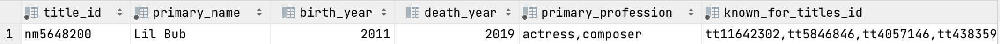

1. 2000-2010 arasında oyuncularından biri tarafından yönetilmiş filmlerin listesi (Çözülemedi.)

2. 2000 yılından günümüze bir filmde müzik departmanında da yer almış aktrislerin listesi

```sql
-- 7s
SELECT * FROM name_basics WHERE birth_year > 2000 AND primary_profession LIKE '%actress%' AND primary_profession LIKE '%music%';

-- 7s 
SELECT * FROM name_basics WHERE birth_year > 2000 AND primary_profession LIKE '%actress%' AND primary_profession LIKE '%compo%';
```

Burada hem musician hem de composer olarak arama yaptım. Sadece composer'da bir çıktı elde edebildim.

 

3. 4 ya da daha fazla aktris bulunduran filmlerin sayısı

```sql
-- 2min
create table result2 select title_id, count('job_category') as cnt from title_principals where job_category='actress' group by title_id having cnt >= 4;
```

Sorgu bana doğru gibi gelse de çok uzun sürdü ve bir sonuç döndürmedi.

